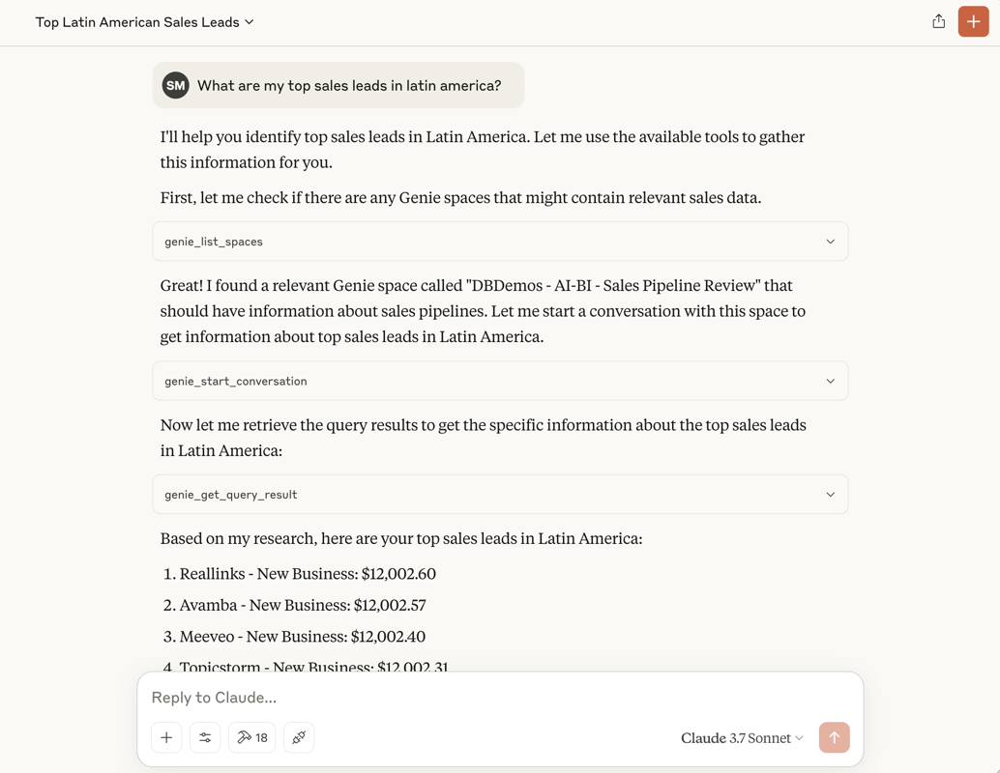

# Databricks MCP servers


Table of Contents
=================

- [Databricks MCP servers](#databricks-mcp-servers)
- [Table of Contents](#table-of-contents)
  - [Overview](#overview)
  - [Unity Catalog Server](#unity-catalog-server)
    - [Databricks Managed MCP servers](#databricks-managed-mcp-servers)
    - [Overview](#overview-1)
    - [Usage (locally via `stdio` transport)](#usage-locally-via-stdio-transport)
    - [Supported tools](#supported-tools)
    - [Deploying UC MCP server on Databricks Apps](#deploying-uc-mcp-server-on-databricks-apps)
      - [Using `databricks bundle` CLI](#using-databricks-bundle-cli)
      - [Using `databricks apps` CLI](#using-databricks-apps-cli)
    - [Connecting to the UC MCP server deployed on Databricks Apps](#connecting-to-the-uc-mcp-server-deployed-on-databricks-apps)
  - [Developer Tools Server](#developer-tools-server)
  - [Deploying a custom MCP server on Databricks Apps](#deploying-a-custom-mcp-server-on-databricks-apps)
  - [Support](#support)
  - [Contributing](#contributing)

## Databricks Managed MCP servers
Databricks provides ready-to-use MCP servers that let agents query data and access tools in Unity Catalog. Permissions are always enforced, so agents and users can only access the tools and data they’re allowed to. For more info see the Databricks docs [AWS](https://docs.databricks.com/aws/en/generative-ai/agent-framework/mcp#managed-mcp-servers)|[Azure](https://docs.databricks.com/gcp/en/generative-ai/agent-framework/mcp#compute-pricing)|[GCP](https://docs.databricks.com/gcp/en/generative-ai/agent-framework/mcp#managed-mcp-servers).

## Overview
An experimental collection of [MCP](https://modelcontextprotocol.io/introduction) servers to help AI agents fetch enterprise data from Databricks, automate common developer actions on Databricks, etc:

* 
  [Databricks Unity Catalog server](#unity-catalog-server): Fetch data and run tools registered in from Unity Catalog, making agents aware of your enterprise data. Note: this server is deprecated; Databricks recomemnds using [Managed MCP servers](#databricks-managed-mcp-servers) instead
* 
  [Databricks developer tools server](#developer-tools-server): Perform common developer actions in Databricks, like creating and updating notebooks, running jobs, etc. This server is not yet usable, but contributions are welcome!
  Note: if developing from within the Databricks product (e.g. using Databricks notebooks), we recommend using [Databricks Assistant](https://docs.databricks.com/aws/en/notebooks/databricks-assistant-faq)

The set of servers and tools in this repo is fluid and will evolve over time. We welcome contributions to this repo - please first
read the [contributor guidelines](CONTRIBUTING.md) to streamline the process and discover areas where help is needed.

## Unity Catalog Server


### Overview

A Model Context Protocol server that exposes structured and unstructured data in Unity Catalog ([vector search indexes](https://docs.databricks.com/gcp/en/generative-ai/vector-search), [functions](https://docs.databricks.com/aws/en/generative-ai/agent-framework/create-custom-tool), and [Genie spaces](https://docs.databricks.com/aws/en/genie/)), as tools.



### Usage (locally via `stdio` transport)

1. Install [uv](https://docs.astral.sh/uv/getting-started/installation/)
1. Install Python using `uv python install 3.12`
1. [Configure Databricks credentials](https://docs.databricks.com/aws/en/dev-tools/cli/authentication) with access to the required APIs
1. Add the server to your MCP client configuration. For example, to use this server with Claude Desktop, add the following to your `claude_desktop_config.json`:

```json
{
  "mcpServers": {
    "databricks_unity_catalog": {
      "command": "/path/to/uv/executable/uv",
      "args": [
        "--directory",
        "/path/to/this/repo",
        "run",
        "unitycatalog-mcp",
        "-s",
        "your_catalog.your_schema",
        "-g",
        "genie_space_id_1,genie_space_id_2"
      ]
    }
  }
}
```

### Supported tools

The list of tools supported by this server is dynamically inferred at startup time based on the functions and vector search indexes
within the specified Unity Catalog schema, as well as any specified Genie spaces. In particular, the server exposes
the following tools:

* **UC Functions**: for each UC function, the server exposes a tool with the same name, arguments, and return type as the function
* **Vector search indexes**: for each vector search index, the server exposes a tool for querying that vector search index
* **Genie spaces**: for each Genie space, the server exposes tools for managing conversations and sending questions to the space

### Deploying UC MCP server on Databricks Apps

You can deploy the Unity Catalog MCP server as a Databricks app. To do so, follow the instructions below:

1. Move into the project directory and build the wheel:
```bash
cd /path/to/this/repo
uv build --wheel
```

There are two ways to deploy the server on Databricks Apps: using the `databricks bundle` CLI or using the `databricks apps` CLI. Depending on your preference, you can choose either method.


#### Using `databricks bundle` CLI

To deploy the server using the `databricks bundle` CLI, follow these steps:

1. Set the env variables for the `schema_full_name` and `genie_space_ids` and run the `bundle deploy` command:
```bash
BUNDLE_VAR_schema_full_name=catalog.schema BUNDLE_VAR_genie_space_ids=[\"space1\",\"space2\"] \
  databricks bundle deploy -p your-profile-name
```

2. Deploy the app:
```bash
BUNDLE_VAR_schema_full_name=catalog.schema BUNDLE_VAR_genie_space_ids=[\"space1\",\"space2\"] \
  databricks bundle run mcp-on-apps -p your-profile-name
```

Please note that `BUNDLE_VAR_genie_space_ids` should be exactly as shown above, with the double quotes escaped, no spaces, and the brackets included.

To connect to your app, use the `Streamable HTTP` transport with the following URL:
```
https://your-app-url.usually.ends.with.databricksapps.com/api/mcp/
```

Please note the trailing `/api/mcp/` in the URL. This is required for the server to work correctly,including the trailing slash.

You'll also need to set the `Authorization` header to `Bearer <your_token>` in your client. You can get the token by running the following command:
```bash
databricks auth token -p your-profile-name
```


If you are a developer iterating on the server implementation, you can repeat steps #2 and #3 to push your latest modifications to the server to your Databricks app.

Please note that both variables should be provided in both `deploy` and `run` commands. The `schema_full_name` variable is used to determine the schema to use for the server, while the `genie_space_ids` variable is used to determine which Genie spaces to use.

#### Using `databricks apps` CLI

To deploy the server using the `databricks apps` CLI, follow these steps:
1. Move into the project directory and build the wheel:
```bash
cd /path/to/this/repo
uv build --wheel
```
2. Configure the `app.yml` file in the root of the project directory. You can use the following example as a starting point:

```yaml
command: ["uvicorn", "databricks.labs.mcp.servers.unity_catalog.app:app"]
env:
  - name: SCHEMA_FULL_NAME
    value: catalog.schema
  - name: GENIE_SPACE_IDS
    value: '["space1","space2"]'
```

3. Deploy the app using the `databricks apps` CLI:
```bash
uv build --wheel
databricks sync ./build -p <your-profile-name> /Workspace/Users/my-email@org.com/my-app
databricks apps deploy my-app-name -p <your-profile-name> --source-code-path /Workspace/Users/my-email@org.com/my-app
databricks apps start my-app-name -p <your-profile-name>
```


### Connecting to the UC MCP server deployed on Databricks Apps

After the app is deployed, you can connect to it using the `Streamable HTTP` transport in your MCP client, such as Claude Desktop or MCP inspector.
To do this, you need to set the target URL to the URL of your app + `/api/mcp/` postfix. Full URL example:
```
https://your-app-url.usually.ends.with.databricksapps.com/api/mcp/
```

**Please note that the URL should end with `/api/mcp/` (including the trailing slash), as this is required for the server to work correctly.**
To connect to the app, you also need to set the `Authorization` header to `Bearer <your_token>`, where `<your_token>` is the token you can get by running the following command:

```bash
databricks auth token -p your-profile-name
```

Please note that app service principal should be entitled with necessary permissions to access the Unity Catalog schema and Genie spaces. You can do this by assigning the appropriate permissions to the service principal in Unity Catalog and Genie.

## Developer Tools Server

This server is currently under construction. It is not yet usable, but contributions are welcome!

## Deploying a custom MCP server on Databricks Apps

If you would like to deploy a custom MCP server on Databricks Apps, take a look at the reference implementation [here](./examples/custom-server/README.md). It provides a step-by-step guide on how to create a custom MCP server and deploy it on Databricks Apps.

## Support
Please note that all projects in the `databrickslabs` GitHub organization are provided for your exploration only, and are not formally supported by Databricks with Service Level Agreements (SLAs).  They are provided AS-IS and we do not make any guarantees of any kind.  Please do not submit a support ticket relating to any issues arising from the use of these projects.

Any issues discovered through the use of this project should be filed as GitHub Issues on the Repo.  They will be reviewed as time permits, but there are no formal SLAs for support.

## Contributing

We welcome contributions :) - see [CONTRIBUTING.md](./CONTRIBUTING.md) for details. Please make sure to read this guide before
submitting pull requests, to ensure your contribution has the best chance of being accepted.

